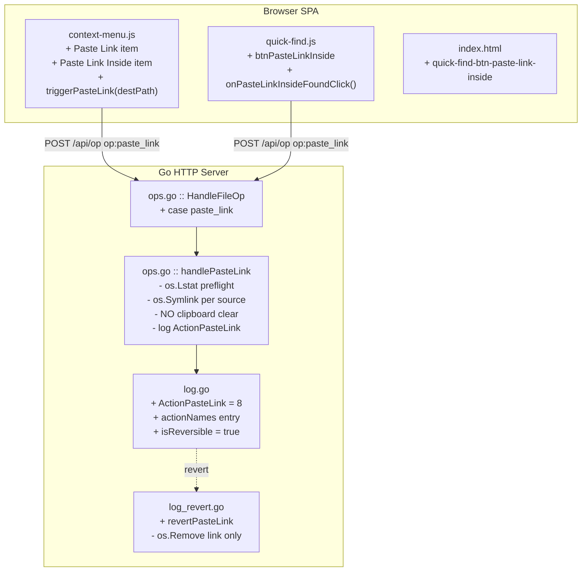
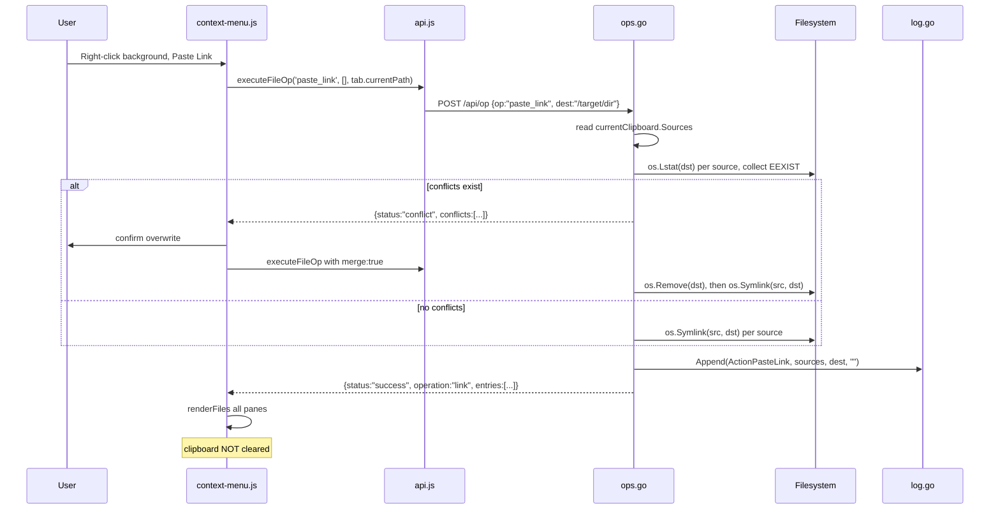

# Architecture Plan: Symlink Paste

> **Slug**: `symlink-paste`
> **Scope**: `api/ops.go`, `api/log.go`, `api/log_revert.go`, `api/dir.go`, `frontend/js/context-menu.js`, `frontend/js/quick-find.js`, `frontend/index.html`

---

## 1. Summary

Add two new paste variants — **Paste Link** and **Paste Link Inside** — that create symlinks at the destination pointing back to the clipboard sources, rather than copying or moving files. The clipboard/copy workflow is completely unchanged: the user still presses Copy (or Cut), then chooses _which kind of paste_ to execute. This keeps the feature surface minimal: one new backend op (`paste_link`), one new log type (`ActionPasteLink = 8`), and mirrored frontend items that follow the existing `paste` / `paste-inside` pattern exactly.

---

## 2. Go Stdlib — Cross-Platform Symlink Support

**[VERIFIED]** Go's `os.Symlink(target, link string) error` is in the standard library with **no third-party package required**. Its platform semantics:

| Platform | Behavior | Caveat |
|---|---|---|
| Linux / macOS | POSIX symlink — just a path stored in an inode. Works for files and dirs. Target need not exist. | None |
| Windows >= 10 (Developer Mode) | Creates NTFS symlink transparently. | Requires Developer Mode **or** admin privileges on older builds |
| Windows (no Developer Mode) | `os.Symlink` returns a privilege error | UI must guard against this |

**Decision**: Do not gate the UI on Linux-only. Surface `runtime.GOOS` as a capability flag in the existing `/api/properties` endpoint so the frontend can disable the buttons with a tooltip on Windows when privileges are unavailable. The backend will always attempt and return a clear error if it fails.

---

## 3. Symlink Target: Absolute vs Relative

**Decision: Absolute paths only in v1.**

Rationale:
- All clipboard sources in zen-man are already absolute paths (set by `handleClipboardSet`).
- `os.Symlink(src, dst)` uses `src` verbatim as the link target — no path resolution needed.
- Relative symlinks require `filepath.Rel(filepath.Dir(dst), src)` and a same-filesystem check, adding edge cases across volume roots on Windows.
- Relative symlink support is explicitly deferred to v1.1.

> [!NOTE]
> On Linux, a symlink's "content" is literally the path string stored in the inode. Opening a symlink in a text editor _does_ show that plain path string — this is normal POSIX behavior, not a bug.

---

## 4. System Architecture — Change Map



---

## 5. Data Flow



---

## 6. Backend Pseudocode

### 6a. `api/log.go`

```go
// Next available after ActionChmod = 7
ActionPasteLink ActionType = 8 // symlinks created at dest, reversible

// In actionNames map:
ActionPasteLink: "paste-link",

// In isReversible():
return a == ActionPasteCopy || a == ActionPasteMove ||
       a == ActionRename    || a == ActionMkdir     ||
       a == ActionPasteLink
```

**Why a new type**: `revertPasteCopy` uses `os.Stat` (follows links). A dedicated type dispatches to `revertPasteLink` which uses `os.Remove` — correct by construction, not by coincidence.

### 6b. `api/log_revert.go`

```go
// In RevertRecord switch:
case ActionPasteLink:
    return revertPasteLink(rec)

// New:
// revertPasteLink removes only the symlink(s) at rec.Dest.
// os.Remove (NOT RemoveAll) is intentional — removes exactly the link, never the target.
func revertPasteLink(rec ActionRecord) error {
    for _, src := range rec.Sources {
        dstPath := filepath.Join(rec.Dest, filepath.Base(src))
        if _, err := os.Lstat(dstPath); os.IsNotExist(err) {
            continue // idempotent
        }
        if err := os.Remove(dstPath); err != nil {
            return fmt.Errorf("revert paste-link: %q: %w", dstPath, err)
        }
    }
    return nil
}
```

### 6c. `api/ops.go`

```go
// In HandleFileOp switch:
case "paste_link":
    handlePasteLink(w, req)

// New function:
func handlePasteLink(w http.ResponseWriter, req OpRequest) {
    // 1. Validate dest
    // 2. Read currentClipboard.Sources (with mutex)
    // 3. If !req.Merge: os.Lstat each dst, collect conflicts, return {status:"conflict"}
    // 4. Loop: if req.Merge, os.Remove(dst); then os.Symlink(src, dst)
    // 5. Collect created entries via os.Lstat(dst) (NOT os.Stat — don't follow the link)
    // 6. NEVER clear clipboard
    // 7. GetLog().Append(ActionPasteLink, paths, req.Dest, "")
    // 8. Return {status:"success", operation:"link", entries:[...]}
}
```

---

## 7. Frontend Pseudocode

### 7a. `context-menu.js`

**`showContextMenu` — background branch (no item selected):**

```js
// After existing "Paste" item:
if (hasClipboard) {
    html += `<div class="context-menu-item" data-action="paste-link">
                 <span>Paste Link</span>
             </div>`;
}
```

**`showContextMenu` — isDir folder branch:**

```js
// After existing "Paste Inside" item:
if (hasClipboard) {
    html += `<div class="context-menu-item" data-action="paste-link-inside"
                  data-target-path="${targetPath}">
                 <span>Paste Link Inside</span>
             </div>`;
}
```

**Event delegation — add two cases:**

```js
} else if (action === 'paste-link') {
    triggerPasteLink();
} else if (action === 'paste-link-inside') {
    triggerPasteLink(targetPath);
}
```

**New exported function:**

```js
export async function triggerPasteLink(destPath = null) {
    // Mirrors triggerPaste exactly, except:
    // - calls executeFileOp('paste_link', [], targetDest)
    // - conflict confirm asks "Overwrite existing entries with new symlinks?"
    // - does NOT clear state.clipboard on success
    // - does NOT handle 'operation === cut' (paste_link is never destructive)
}
```

### 7b. `quick-find.js`

**`setupModalListeners` / `removeModalListeners`:**

```js
const btnPasteLinkInside = document.getElementById('quick-find-btn-paste-link-inside');
btnPasteLinkInside.addEventListener('click', onPasteLinkInsideFoundClick);
```

**`updateActionButtonsState`:**

```js
// Same visibility logic as btnPasteInside (scopeFilter === 'folder')
// Same enable condition (hasResults && hasFolders && hasClipboard)
```

**`onPasteLinkInsideFoundClick`:**

```js
// Mirrors onPasteInsideFoundClick exactly, except:
// - calls executeFileOp('paste_link', [], folderPath)
// - NEVER clears state.clipboard after success
```

### 7c. `index.html`

```html
<!-- After #quick-find-btn-paste-inside -->
<button id="quick-find-btn-paste-link-inside"
        class="btn-quick-find-action"
        disabled
        style="display:none"
        title="Paste clipboard items as symlinks inside found folders">
    Paste Link Inside
</button>
```

---

## 8. Failure Modes

| Failure | Mitigation |
|---|---|
| `os.Symlink` EEXIST (dst exists) | `os.Lstat` pre-flight returns conflict list; frontend confirms overwrite; `merge:true` calls `os.Remove(dst)` first |
| Windows no Developer Mode / no admin | `/api/properties` exposes `runtime.GOOS`; frontend disables buttons; backend returns clear error |
| Partial batch failure | Loop continues; records `lastErr`; error returned to client. Successfully created links are logged. |
| Symlink cycle (`dir/link -> dir`) | **[VERIFIED]** `fs.DirEntry.IsDir()` returns `false` for symlinks — `CalculateDirSize` and `HandleReadDirectory` WalkDir never descend into them |
| "cut" clipboard + Paste Link | Clipboard never cleared. Sources untouched. Correct: a link paste is always non-destructive |
| Dangling symlink (source deleted between Copy and Paste Link) | `os.Symlink` succeeds regardless — POSIX allows dangling links. No special handling needed |

---

## 9. FileEntry / Symlink Display

**[VERIFIED]** `dir.go::HandleReadDirectory` calls `entry.IsDir()` on `fs.DirEntry` from `os.ReadDir`. Go's `os.ReadDir` does **not** follow symlinks. Therefore a freshly pasted symlink-to-directory appears as 📄 (file) in the file list, and double-click opens it rather than navigating into it.

**Decision: Accept for v1.** The `mode` field already exposes `Lrwxrwxrwx`, so detection is possible. A dedicated `is_symlink bool` field in `FileEntry` + a distinct 🔗 icon is a clean, isolated follow-up PR.

---

## 10. Key Decisions

| Decision | Alternative | Rejection Rationale |
|---|---|---|
| `ActionPasteLink = 8` | Reuse `ActionPasteCopy` | `revertPasteCopy` uses `os.Stat`; safe today but risky under future refactor |
| Absolute symlink targets | Relative via `filepath.Rel` | Cross-volume edge case + extra code; deferred to v1.1 |
| `os.Lstat` for conflict check | `os.Stat` | `os.Stat` follows links — dangling link at dst looks absent; `os.Lstat` is always correct |
| Never clear clipboard | Clear on "cut" like normal paste | Sources untouched by link paste; clearing destroys the only reference |
| `os.Remove` in revert | `os.RemoveAll` | `os.RemoveAll` is semantically "recursive delete"; `os.Remove` is explicit and safe for a single link |
| Accept `is_dir=false` for v1 | Add `is_symlink` to `FileEntry` now | Orthogonal change; `FileEntry` used in 6 files; deserves focused PR |

---

## 11. Red-Team Critique Summary

| Critique (from claude browser.chat) | Disposition |
|---|---|
| `ActionPasteLink = 6` collides with `ActionMkdir` — compile error in map literal | **Folded in** — using `= 8` |
| Reusing `ActionPasteCopy` is dangerous for revert path | **Folded in** — dedicated type with `revertPasteLink` using `os.Remove` |
| "no conflict logic needed" claim is wrong — `os.Symlink` never overwrites | **Folded in** — full `os.Lstat` pre-flight added |
| Clipboard cut-consumption bug — Paste Link must never clear clipboard | **Folded in** — explicit guard in backend and frontend |
| Symlink cycle safety in walkers | **Folded in** — [VERIFIED] safe via `DirEntry.IsDir()` behavior |
| `FileEntry` display gap for symlink-dirs | **Partially folded** — accepted for v1, tracking `is_symlink` follow-up |
| Relative symlinks as default | **Rejected for v1** — deferred to v1.1 |
| Windows: expose capability flag in `/api/properties` | **Folded in** — noted in §2 and §8 |

---

## 12. Open Questions

- [ ] **`is_symlink` in `FileEntry`**: `os.Lstat` per entry (perf on large dirs) or lazy on hover/click?
- [ ] **Relative symlink mode**: Separate menu item? Global preference? Deferred.
- [ ] **Windows capability probe**: Probe at startup via temp-file `os.Symlink` rather than `runtime.GOOS` check?
- [ ] **Shortcut**: Reserve `Ctrl+Alt+V` for Paste Link?
